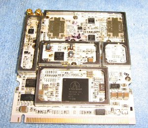

Some notes for experimental long-distance wifi on 420-430Mhz project. See [430MHz Data Transfer](http://ameba.ehion.com/site/430mhz_data_transfer/) 

OpenWRT Config for first radio:

    config wifi-device 'radio0'
    	option type 'mac80211'
	    option channel '11'
    	option hwmode '11ng'
	    option path 'pci0000:00/0000:00:11.0'
	    option htmode 'HT20'
    	list ht_capab 'SHORT-GI-40'
    	list ht_capab 'TX-STBC'
    	list ht_capab 'RX-STBC1'
    	list ht_capab 'DSSS_CCK-40'
	    option disabled '0'

    config wifi-iface
    	option device 'radio0'
    	option network 'lan'
    	option mode 'ap'
    	option ssid 'OpenWrt'
    	option encryption 'none'

    config wifi-device 'radio1'
    	option type 'mac80211'
    	option chanbw '5'
    	option hwmode '11g'
    	option path 'pci0000:00/0000:00:12.0'
    	option channel '2'
    	option txpower '27'
    	option country '00'

    config wifi-iface
    	option device 'radio1'
    	option network 'lan'
    	option ssid '420nobox'
    	option encryption 'none'
    	option mode 'sta'

OpenWRT Config for second radio:

    config wifi-device 'radio0'
    	option type 'mac80211'
    	option hwmode '11g'
    	option path 'pci0000:00/0000:00:11.0'
    	option chanbw '5'
    	option country '00'
    	option txpower '20'
    	option channel 'auto'

    config wifi-iface
    	option device 'radio0'
    	option mode 'ap'
    	option ssid '400a'
    	option encryption 'none'
    	option network 'lan wlanlong'

    config wifi-device 'radio1'
    	option type 'mac80211'
    	option channel '11'
    	option hwmode '11ng'
    	option path 'pci0000:00/0000:00:12.0'
    	option htmode 'HT20'
    	list ht_capab 'SHORT-GI-40'
    	list ht_capab 'TX-STBC'
    	list ht_capab 'RX-STBC1'
    	list ht_capab 'DSSS_CCK-40'

    config wifi-iface
    	option device 'radio1'
    	option network 'lan'
    	option mode 'ap'
    	option ssid 'OpenWrt'
    	option encryption 'none'

